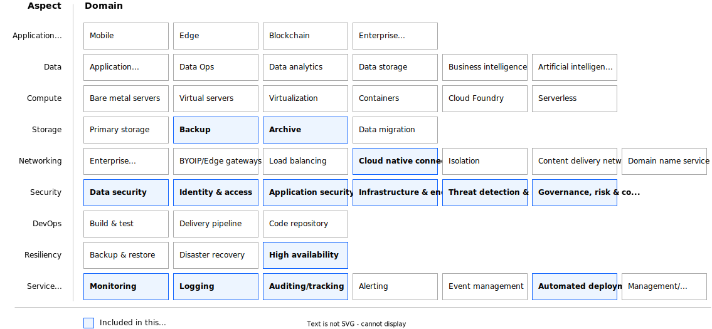

---

copyright:
  years: 2024, 2025
lastupdated: "2025-09-05"

subcollection: deployable-reference-architectures

authors:
- name: Dharmesh Bhakta
  email: bhakta@ibm.com

# The release that the reference architecture describes
version: 4.0.0

# Use if the reference architecture has deployable code.
# Value is the URL to land the user in the IBM Cloud catalog details page for the deployable architecture.
# See https://test.cloud.ibm.com/docs/get-coding?topic=get-coding-deploy-button
deployment-url: https://cloud.ibm.com/catalog/architecture/deploy-arch-ibm-core-security-svcs-0294f96e-7314-48d1-a710-c08a541b2119-global

use-case:
  - CloudSecurity
  - KeyManagement
  - CloudSecurityAndCompliance
  - DataCompliance
  - Governance
  - GRC

industry: SoftwareAndPlatformApplications, Technology, Banking, FinancialSector

compliance: CIS Benchmarks

docs: https://cloud.ibm.com/docs/security-hub

content-type: reference-architecture

production: true

---
<!--
The following line inserts all the attribute definitions. Don't delete.
-->
{{site.data.keyword.attribute-definition-list}}

<!--
Don't include "reference architecture" in the following title.
Specify a title based on a use case. If the architecture has a module
or tile in the IBM Cloud catalog, match the title to the catalog. See
https://test.cloud.ibm.com/docs/solution-as-code?topic=solution-as-code-naming-guidance.
-->

# Cloud foundation for security and observability
{: #core-security-services-pattern}
{: toc-content-type="reference-architecture"}
{: toc-version="4.0.0"}

<!--
The IDs, such as {: #title-id} are required for publishing this reference architecture in IBM Cloud Docs. Set unique IDs for each heading. Also include
the toc attributes on the H1, repeating the values from the YAML header.
 -->

This reference architecture summarizes the deployment and best practices on {{site.data.keyword.cloud_notm}} for setting essential security services and their associated dependencies. {{site.data.keyword.cloud_notm}}'s essential security services are crucial for ensuring robust security and compliance for cloud-based applications and data. Their primary goal is to provide a framework for secure and compliant {{site.data.keyword.cloud_notm}} workloads.

Here’s a brief overview of each service:

{{site.data.keyword.keymanagementserviceshort}}: This service provides a secure and scalable way to manage encryption keys for your cloud applications. It ensures that sensitive data is protected by managing and safeguarding cryptographic keys, facilitating compliance with industry standards and regulatory requirements.

{{site.data.keyword.secrets-manager_short}}: This service helps in securely storing and managing sensitive information such as API keys, credentials, and certificates. By centralizing secret management, it reduces the risk of exposure and simplifies the process of accessing and rotating secrets, thereby enhancing the security posture.

{{site.data.keyword.sysdigsecure_full_notm}}: This service offers features to protect workloads, get deep cloud and container visibility, posture management (compliance, benchmarks, CIEM), vulnerability scanning, forensics, and threat detection and blocking.

This reference architecture showcases how these services form a foundational security layer that enhances data protection, simplifies compliance, and strengthens overall cloud security for any workload in {{site.data.keyword.cloud_notm}}.

## Architecture diagram
{: #architecture-diagram}

The following diagram represents the architecture for the Cloud foundation for security and observability deployable architecture on and reuses the [best practices](/docs/framework-financial-services?topic=framework-financial-services-about) for {{site.data.keyword.framework-fs_full}}.

{: caption="Figure 1. Architecture diagram" caption-side="bottom"}{: external download="core-security-services-architecture.svg"}

The architecture is anchored by three fundamental services: {{site.data.keyword.keymanagementserviceshort}}, {{site.data.keyword.secrets-manager_short}}, and {{site.data.keyword.compliance_short}}. These services provide integration endpoints for any customer workload that is hosted on {{site.data.keyword.cloud_notm}}.

1. {{site.data.keyword.keymanagementserviceshort}}

  {{site.data.keyword.keymanagementserviceshort}} is responsible for centrally managing the lifecycle of encryption keys that are used by {{site.data.keyword.cos_full_notm}} buckets, {{site.data.keyword.secrets-manager_short}}, and event notification resources. Additionally, it can manage encryption keys for any customer workload that requires protection.

2. {{site.data.keyword.secrets-manager_short}}

  {{site.data.keyword.secrets-manager_short}} securely stores and manages sensitive information, including API keys, credentials, and certificates. It uses encryption keys from {{site.data.keyword.keymanagementserviceshort}} to encrypt sensitive data and to seal and unseal vaults that hold the secrets. It is preconfigured to send events to the {{site.data.keyword.en_short}} service, allowing customers to set up email or SMS notifications. Moreover, it is automatically configured to forward all API logs to the customer's logging instance.

3. {{site.data.keyword.sysdigsecure_full_notm}}

  The {{site.data.keyword.sysdigsecure_full_notm}} instance is pre-configured with Cloud Security Posture Management (CSPM) enabled using the Configuration Aggregator features from the App Configuration instance that is also provisioned as part of this solution.

{{site.data.keyword.cos_full_notm}} buckets are set up to receive logs from logging and alerting services. Each bucket is configured to encrypt data at rest by using encryption keys managed by {{site.data.keyword.keymanagementserviceshort}}.

## Design concepts
{: #design-concepts}

- Storage: Backup, Archive
- Networking: Cloud-native connectivity
- Security: Data security, identity and access, application security, threat detection and response, infrastructure and endpoints, governance, risk and compliance
- Resiliency: High availability
- Service management: Monitoring, logging, auditing and tracking, automated deployment

{: caption="Figure 2. Architecture design scope" caption-side="bottom"}{: external download="heat-map-ccs.svg"}

## Requirements
{: #requirements}

The following table outlines the requirements that are addressed in this architecture.

| Aspect | Requirements |
| -------------- | -------------- |
| Networking         | Provide secure, encrypted connectivity to the cloud’s private network for management purposes. |
| Security           | Encrypt all application data in transit and at rest to protect it from unauthorized disclosure. \n Encrypt all security data (operational and audit logs) to protect from unauthorized disclosure. \n Encrypt all data using customer-managed keys to meet regulatory compliance requirements for additional security and customer control. \n Protect secrets through their entire lifecycle and secure them using access control measures. |
| Resiliency         | Support application availability targets and business continuity policies. \n Ensure availability of the application during planned and unplanned outages. \n Back up application data to enable recovery during unplanned outages. \n Provide highly available storage for security data (logs) and backup data. |
| Service Management | Monitor system and application health metrics and logs to detect issues that might impact the availability of the application. \n Generate alerts/notifications about issues that might impact the availability of applications to trigger appropriate responses to minimize downtime. \n Monitor audit logs to track changes and detect potential security problems. \n Provide a mechanism to identify and send notifications about issues that are found in audit logs. |
{: caption="Table 1. Requirements" caption-side="bottom"}

## Components
{: #components}

The following table outlines the products or services used in the architecture for each aspect.

| Aspects | Architecture components | How the component is used |
| -------------- | -------------- | -------------- |
| Storage | [{{site.data.keyword.cos_full_notm}}](https://cloud.ibm.com/docs/cloud-object-storage?topic=cloud-object-storage-about-cloud-object-storage) | Web app static content, backups, logs (application, operational, and audit logs) |
| Networking | [Virtual Private Endpoint (VPE)](https://cloud.ibm.com/docs/vpc?topic=vpc-about-vpe) | For private network access to {{site.data.keyword.cloud_notm}} services, for example, {{site.data.keyword.keymanagementserviceshort}} and {{site.data.keyword.secrets-manager_short}}. |
| Security | [IAM](https://cloud.ibm.com/docs/account?topic=account-cloudaccess) | {{site.data.keyword.iamshort}} |
|  | [{{site.data.keyword.keymanagementserviceshort}}](https://cloud.ibm.com/docs/key-protect?topic=key-protect-about) | A full-service encryption solution that allows data to be secured and stored in {{site.data.keyword.cloud_notm}} |
|  | [{{site.data.keyword.secrets-manager_short}}](https://cloud.ibm.com/docs/secrets-manager?topic=secrets-manager-getting-started#getting-started) | Certificate and Secrets Management |
|  | [{{site.data.keyword.sysdigsecure_full_notm}}](https://cloud.ibm.com/docs/workload-protection?topic=workload-protection-getting-started) | Implement controls for secure data and workload deployments, and assess security and compliance posture |
| Service Management | [{{site.data.keyword.monitoringlong_notm}}](https://cloud.ibm.com/docs/monitoring?topic=monitoring-about-monitor) | Apps and operational monitoring |
|  | [{{site.data.keyword.logs_full_notm}}](https://cloud.ibm.com/docs/cloud-logs?topic=cloud-logs-getting-started) | Apps and operational logs |
|  | [{{site.data.keyword.atracker_short}}](https://cloud.ibm.com/docs/atracker?topic=atracker-getting-started) | Audit logs |
{: caption="Table 2. Components" caption-side="bottom"}

## Compliance
{: #compliance}

Ensures compliance with some of the controls in the CIS IBM Cloud Foundations Benchmark profile. To view the list of added controls, follow these steps:

1.  Go the {{site.data.keyword.cloud_notm}} [catalog](/catalog#reference_architecture){: external} and search for the Cloud foundation for security and observability deployable architecture.
1.  Click the tile for the deployable architecture to open the details. The Security & compliance tab lists all of the controls that are included in the deployable architecture.
